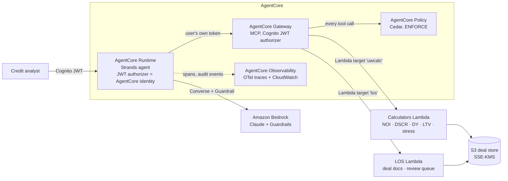

# Agentic Credit Underwriting Assistant for CRE and Agri Lending

**Amazon Bedrock AgentCore · Strands Agents · MCP · Cedar · OpenTelemetry · AWS CDK**

A production-style reference implementation of an agent that prepares commercial real estate (CRE)
and agricultural loan underwriting packages. It ingests rent rolls, T-12 operating statements and
farm cash-flow projections, calls **deterministic** calculation services for NOI, DSCR, debt yield,
LTV and seasonal cash-flow stress, flags credit-policy exceptions, and drafts a **cited** credit memo
for a human analyst.

**It never approves or declines a loan.** That rule is enforced in three independent places
(AgentCore Policy on the Gateway, an in-agent guard hook, and an output check), and the evaluation
suite proves it on every build.

> All data is synthetic. This is a reference implementation built to production patterns, not a
> system deployed at a bank.

---

## Architecture



| Concern | How it is handled | Where |
|---|---|---|
| LLM never does arithmetic | Model passes only IDs; all figures computed in Python and returned with citation anchors | `src/underwriter/calculators/`, `service.py` |
| Cited memo | Every number must cite an anchor (`[calc:cre:CRE-001#dscr]`); verifier checks value match | `memo/citations.py` |
| No credit decisions | Cedar `forbid` on decision/notice tools · `ActionGuardHook` · decision-language check · Guardrail denied topic | `infra/policies/`, `agent/hooks.py`, `policy/action_guard.py`, `infra/stack.py` |
| Human approval before writes | Strands interrupt pauses `submit_memo_for_analyst_review` until the analyst approves | `agent/hooks.py`, `agent/app.py` |
| User-scoped access | Cognito token (role + portfolio claims) forwarded Runtime → Gateway; Cedar checks role & portfolio; Lambda checks deal ∈ portfolio | `services/cognito_pretoken/`, `infra/policies/`, `service.py` |
| PII | Tool results carry aggregates only (no tenant names); Bedrock Guardrail PII filters | `service.py`, `infra/stack.py` |
| Tracing and audit | Strands OTel spans via ADOT → AgentCore Observability; one audit event per tool call with user, args hash, latency; tokens + cost per run | `observability/`, `Dockerfile` |
| Quality gate | Labelled synthetic deals; extraction, metric, exception, citation, safety scores; CI fails below thresholds | `evals/` |
| Rollback | Versioned Runtime; `prod` endpoint repointed in one call | `scripts/rollback.py` |

## Quickstart (no AWS account needed)

```bash
make install        # pip install -e ".[agent,dev]"
make test           # 44 unit tests, including the real Strands loop with a scripted model
make eval           # offline evaluation over 40 labelled deals, with deployment gates
make demo DEAL=AG-003
```

With AWS credentials and Bedrock model access:

```bash
export BEDROCK_MODEL_ID=<inference profile id from the Bedrock console>
make demo-agent DEAL=CRE-004   # agent on Bedrock, local tools, asks you before filing
make eval-live                 # live evaluation + red team -> evals/reports/latest_live.md
```

Deploy to AWS: follow **[docs/BUILD_GUIDE.md](docs/BUILD_GUIDE.md)**.

## Evaluation (measured)

Offline baseline, deterministic pipeline, 40 synthetic deals (26 CRE, 14 agricultural), seed 42.
Ground truth comes from an **independent** reference implementation in the generator, not from the
production calculators. Full report: [`evals/reports/baseline_offline.md`](evals/reports/baseline_offline.md).

| Measure | Offline baseline |
|---|---|
| Extraction accuracy (473 fields) | **97.9%** |
| Metric correctness (484 fields, ±0.5% / ±0.01x / ±0.1pt) | **89.7%** (30 / 40 deals fully correct; all 14 agri deals correct) |
| Policy-exception exact match | **92.5%** (recall 100%, precision 90.6%) |
| Decision-language hits / fabricated citations | **0 / 0** |

Every metric miss traces to T-12 labels that the keyword mapper does not know (for example
"RUBS Income", "Ancillary Revenue", "Admin Fees" filed under income). The parser leaves them
unmapped and warns rather than guessing; in live mode the agent classifies them with
`map_t12_label` and an audited rationale. Run `make eval-live` to measure the lift and record your
own live numbers (citation faithfulness of model-written memos, tokens, cost, latency).
Offline citation faithfulness is 100% by construction (template memo), so it only checks the
harness; the faithfulness figure worth quoting comes from the live run.

## Repository layout

```
src/underwriter/
  calculators/     deterministic CRE + agri math (pure functions)
  ingestion/       rent roll, T-12, farm financials parsers; PII redaction
  policy/          credit-policy exception engine; action guard + decision-language check
  memo/            evidence ledger, template drafter, citation verifier
  agent/           Strands agent: prompts, local tools, hooks, factory, AgentCore entrypoint
  observability/   audit events, token/cost attribution on OTel spans
  service.py       the one implementation behind every tool (local or Gateway)
  data/            credit_policy.yaml, model_pricing.yaml
services/          Gateway Lambda handler, tool schemas, Cognito pre-token trigger
infra/             CDK stack + Cedar policies
evals/             synthetic generator, labelled data, scoring, runner, thresholds, red team
scripts/           local demo, seed, invoke, rollback
docs/              build guide, architecture, interview prep, resume
```

## Documentation

- [docs/BUILD_GUIDE.md](docs/BUILD_GUIDE.md): step-by-step build and deploy, plus first-deploy checks
- [docs/ARCHITECTURE.md](docs/ARCHITECTURE.md): request flow, controls, data model, design decisions
- [docs/INTERVIEW_PREP.md](docs/INTERVIEW_PREP.md): how to explain and demo every claim
- [docs/RESUME.md](docs/RESUME.md): resume bullets tied to evidence in this repo
- [docs/kindle/](docs/kindle/): all of the above as a Kindle Scribe study guide PDF (`make kindle` rebuilds it)
