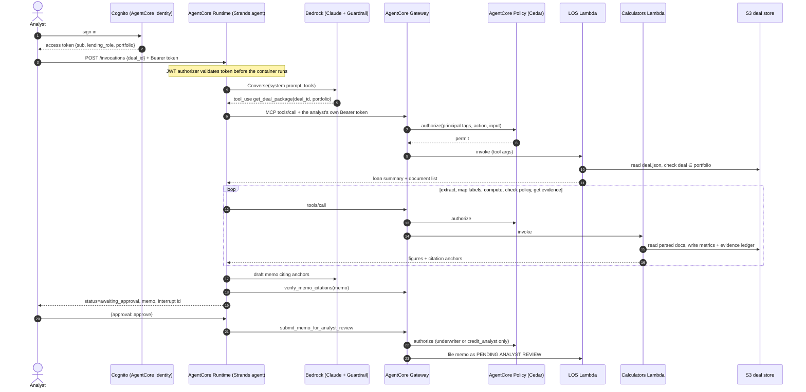

# Architecture

## 1. Request flow

## 2. Why the model never does the math

- **Accuracy.** Language models predict tokens. They are not reliable calculators, and a DSCR that
  is wrong in the second decimal can move a deal across a policy line.
- **Reproducibility.** Credit decisions must be reproducible for audit and model-risk validation
  (SR 11-7). A pure function with versioned inputs gives the same answer every time; sampling does not.
- **Validation scope.** The calculators can be unit-tested and validated like any other model
  component. The LLM's role (orchestration, label classification, narrative) is validated
  separately, by the evaluation suite.
- **Mechanism, not instruction.** The prompt says "never do arithmetic", but the design does not
  rely on that: tools take only identifiers, so no figure passes through the model on its way into
  a calculation. Figures come out of tools with anchors, and the citation verifier rejects any
  memo number that does not match a cited ledger value (so a derived "total" without a source fails).

## 3. Why the credit decision stays human

- **ECOA / Regulation B.** A creditor must give specific principal reasons for adverse action.
  Those reasons, and the decision, must be owned by an accountable person under the bank's
  approval authority.
- **Delegated authority.** Credit approval authority is delegated to named officers by amount and
  risk. An agent is not on that schedule.
- **Model risk.** Keeping the agent to *preparation* keeps its outputs advisory: errors are caught
  by the analyst before they affect a borrower.

The agent therefore has no decision capability, and four independent controls back that up:

| Layer | Control | Scope |
|---|---|---|
| Gateway | Cedar `forbid` on `los___record_credit_decision` and `los___send_adverse_action_notice` (`infra/policies/03_forbid_decisions.cedar`) | Every principal, whatever the agent code does |
| Agent loop | `ActionGuardHook` cancels forbidden tools before any network call | In-process, also in local/offline runs |
| Output | `find_decision_language` blocks memos and responses that state or recommend a decision; the LOS also refuses to file them | Text |
| Model | Bedrock Guardrail denied topic "CreditDecision" plus prompt-attack filter | Model input and output |

## 4. Identity and least privilege

1. Cognito user attributes `custom:lending_role` and `custom:portfolio` are copied into the access
   token by the pre-token-generation trigger (`services/cognito_pretoken/handler.py`).
2. The Runtime's JWT authorizer validates the token. `Authorization` is allow-listed so the agent
   can read it and forward it.
3. The agent connects to the Gateway with **the user's token**, not a service credential. The
   Gateway's JWT authorizer validates it again.
4. Cedar policies use the token claims as principal tags:
   - read tools: any role, `context.input.portfolio == principal.getTag("portfolio")`
   - calculation, label mapping, filing: `underwriter` or `credit_analyst` only
   - decision and notice tools: forbidden for all
5. The LOS Lambda checks the requested deal belongs to the portfolio in the input. Together with
   step 4, a user can only reach deals in their own portfolio.
6. Each Lambda has its own role: read `deals/*`, write only `deals/*/work/*`.

## 5. Data model and citations

`EvidenceLedger` (`memo/evidence.py`) is a map from anchor to value, written by each tool:

| Anchor | Source |
|---|---|
| `loan:CRE-001#loan_amount` | loan request |
| `doc:CRE-001-RR#occupied_units` | parsed rent roll |
| `doc:CRE-001-T12#real_estate_taxes` | parsed T-12 category total |
| `calc:cre:CRE-001#dscr` | calculator output |
| `calc:agri:AG-003#stress.combined_downside.tdcr` | stress scenario output |
| `policy:CRE-001#CP-3.1.1.actual` | policy exception |

The verifier (`memo/citations.py`) splits the memo into claim units (sentences and table rows),
finds every number, and requires a cited anchor in the same unit whose value matches the number at
its displayed precision ($ amounts, %, x multiples, K/M suffixes). It reports faithfulness
(supported / all numbers), coverage (cited / all numbers) and fabricated anchors.

## 6. Underwriting conventions (synthetic policy)

**CRE:** GPR from the rent roll (vacant units at asking rent). Vacancy = max(rent-roll economic
vacancy, T-12 vacancy + concessions + bad debt, property-type floor). Management fee = max(actual,
3% of EGI). Reserves $300/unit (multifamily) or $0.20/SF. DSCR on the amortizing payment, never on
interest-only. Maximum loan = min of DSCR-, LTV- and debt-yield-constrained amounts.

**Agricultural:** CADS = revenue − operating expenses − family living − income taxes. TDCR = CADS /
(existing + proposed debt service). The annual payment falls in the month of peak crop receipts;
taxes in April. Each scenario is walked month by month from opening cash, drawing on the operating
line when cash goes negative. Scenarios: base, price −15%, yield −20%, combined (−10% price,
−10% yield, +10% inputs, +200 bp).

## 7. Observability

- Strands emits OpenTelemetry spans for each agent cycle, model call and tool call. The container
  runs under `opentelemetry-instrument` (ADOT), and the Runtime has tracing enabled, so spans land
  in AgentCore Observability / CloudWatch GenAI Observability.
- `observability/audit.py` writes one JSON audit event per tool call (user, deal, tool, args hash,
  status, latency), attached to the active span as an event and printed to CloudWatch Logs, so a
  trace and its audit records join on `trace_id`.
- `observability/cost.py` sets `underwriting.input_tokens`, `underwriting.output_tokens`,
  `underwriting.estimated_cost_usd` and `underwriting.latency_s` on the run span.
- The CDK dashboard plots Runtime invocations, errors and latency, Gateway latency, and Policy
  authorizations against denials.

## 8. Design decisions and trade-offs

| Decision | Alternative | Why |
|---|---|---|
| Tools take IDs, state lives in S3 | Pass parsed data through the model | Keeps figures out of the model; smaller context; auditable intermediate files |
| Keyword mapper + agent fallback for T-12 labels | LLM classifies every line | Deterministic for known labels; the model handles only the long tail, with a rationale the analyst sees |
| Two Lambda targets | One Lambda | Separate IAM per capability; Cedar can scope calculators and LOS separately |
| Lambda targets for LOS | API Gateway / OpenAPI target | Simplest reliable path for the reference build. A real LOS with a REST API plugs in through Gateway's API Gateway or OpenAPI target type without code changes to the agent |
| Template memo offline, model memo live | Model memo only | CI stays free and deterministic; the live run measures the model |
| Regression gates at baseline | Fixed aspirational gates | Gates should catch regressions, not block on known gaps |
